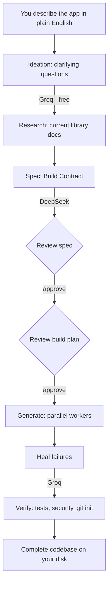

<div align="center">

# ▰ Pragma

### Describe an app in plain English. Get a complete, runnable project on your machine.

[](https://go.dev)
[](https://python.org)
[](https://kit.svelte.dev)
[](LICENSE)
[](https://platform.deepseek.com)
[](#privacy)

**No subscription. No cloud. No coding knowledge required.**

*APIs, database, auth, Docker, tests — and an optional React/Next.js UI when your idea needs one — generated locally with bring-your-own AI keys.*

<!-- demo video here -->

</div>

---

## For Everyone — Get Running in 5 Minutes

You do not need to install Go or Node to **run** Pragma. Download the binary, set up the Python daemon once, add two API keys, and describe your app.

### 1. Download Pragma

Go to **[Releases](https://github.com/sarv-projects/pragma/releases/latest)** and download the binary for your OS:

| OS | File |
|----|------|
| Linux (x86) | `pragma-linux-amd64` |
| Mac (Apple Silicon) | `pragma-darwin-arm64` |
| Mac (Intel) | `pragma-darwin-amd64` |
| Windows | `pragma-windows-amd64.exe` |

**Linux / Mac** — make it executable and move it to your PATH:

```bash
chmod +x pragma-linux-amd64
sudo mv pragma-linux-amd64 /usr/local/bin/pragma
```

### 2. Install the Python Daemon

Pragma uses a small Python process to talk to the AI. After the binary is on your PATH, run:

```bash
pragma setup
```

This creates `~/.pragma/venv`, installs dependencies, and prepares the daemon.

> **Requires Python 3.11+.** Get it at [python.org/downloads](https://www.python.org/downloads/) if you do not have it.

### 3. Run Pragma

```bash
pragma
```

Your browser opens at `http://localhost:3777`. On **WSL**, the URL is printed in the terminal — paste it into your Windows browser (Edge, Chrome, or Firefox).

### 4. Add Your API Keys in the Setup Guide

On first run, the **Setup Guide** walks you through both keys step by step.

**DeepSeek** (required — powers code generation; pay-as-you-go, typically cost-effective per project):

1. Sign up at [platform.deepseek.com](https://platform.deepseek.com)
2. Top Up → add a small credit balance (no subscription)
3. API Keys → Create key → paste it in the Setup Guide

**Groq** (required — free, enables image analysis and faster chat):

1. Sign up at [console.groq.com](https://console.groq.com) (no credit card)
2. API Keys → Create → paste in the Setup Guide

> **Both keys are required.** DeepSeek writes your application code. Groq powers the conversation, image analysis, and fast repair passes — at no cost.

### 5. Describe Your App

Type what you want in plain English. Pragma **auto-selects** a sensible stack from your description (you can steer it in text, e.g. “use Node and React” or “backend only”), asks a few questions, then generates:

- A complete REST API (Python, Node.js, or Go)
- **Or** a full-stack web app with **Next.js** when your description implies a UI
- Database setup (PostgreSQL or SQLite)
- Docker Compose so you can run it immediately
- Tests, security checks, and a plain-English README for the output folder

> **Scope:** Pragma targets **web backends and full-stack web apps**. It does not generate native mobile apps (iOS/Android binaries).

### Upload an Image (Optional)

Have a mockup, screenshot, or architecture diagram? Upload it during project setup. Vision analysis (**Groq Llama 4 Scout**) extracts API design, data models, and integrations into your project manifest. Images are sent to Groq only, not to DeepSeek.

### Check Your Setup

```bash
pragma doctor
```

Checks Python, the daemon, your API keys, Docker, and network connectivity.

### Upgrade

```bash
pragma upgrade
```

Updates the binary **and** the Python daemon from GitHub Releases.

---

## Why Pragma exists

Many AI app builders excel at a polished UI in the browser but leave you without a serious server, database, and deployment story you own. IDE copilots assume you already know how to code. Heavy agents cost like hiring help and still run in someone else's cloud.

Pragma is different: **you describe the product in plain English, and a complete, runnable project lands in a folder on your machine.** Not a scaffold. Not a pile of `TODO`s. Routes, models, auth patterns, Docker, and tests — reviewed against a spec before you approve generation.

It stays **cost-effective** because you bring your own DeepSeek and Groq keys (pay-as-you-go, no Pragma subscription) and generation runs locally under your control.

---

## How it stacks up

| | **Pragma** | Lovable | Bolt | Cursor | Devin |
|---|---|---|---|---|---|
| **Cost model** | **Pay-as-you-go AI keys; no Pragma subscription** | Monthly subscription | Monthly subscription | Monthly subscription | High monthly |
| **What you get** | **Full API + DB + auth + Docker + tests; optional Next.js UI** | Hosted full-stack (React + Supabase) | In-browser full-stack (JS) | You write it | Agent-driven stack |
| **Where your code lives** | **Your disk, always** | Their cloud | Their cloud | Your machine | Their cloud |
| **Runs offline after generation** | **Yes (your repo)** | No | No | Yes | No |
| **Usable with little coding skill** | **Yes (guided flow)** | Yes | Partly | No | Partly |
| **Resumes after a crash** | **Yes — checkpointed** | n/a | n/a | n/a | Partial |

Pragma is strongest when you want **real source code on disk**, a **proper backend**, and **optional full-stack web** — without locking the project inside a hosted builder.

---

## What you actually get

Type *"A leave-management app where employees submit time-off requests and managers approve them"* and Pragma can hand back:

- **Every source file, fully implemented** — no stubs, no `TODO`, no placeholder functions
- **Database models + migrations** — PostgreSQL or SQLite
- **API routes with auth** — JWT, OAuth patterns, and session options depending on stack
- **OpenAPI 3.0 specification** — API documentation generated with the project
- **CI workflows** — GitHub Actions for lint, test, and deploy stubs where applicable
- **`Dockerfile` + `docker-compose.yml`** — run the generated app locally
- **A passing test suite** — generated and executed before delivery when the pipeline completes
- **A plain-English README** in the output folder — written for non-developers where possible

**Stacks (auto-selected from your description; mention preferences in plain English):**

| Profile | Stack | Database |
|---------|-------|----------|
| `fastapi-async` | Python 3.12 · FastAPI · SQLAlchemy 2.0 · Alembic | PostgreSQL |
| `fastapi-async-sqlite` | Python 3.12 · FastAPI · SQLAlchemy 2.0 · Alembic | **SQLite** |
| `express-drizzle` | TypeScript · Express 5 · Drizzle ORM | PostgreSQL |
| `express-drizzle-sqlite` | TypeScript · Express 5 · Drizzle ORM | **SQLite** |
| `express-prisma` | TypeScript · Express 5 · Prisma | PostgreSQL |
| `express-prisma-sqlite` | TypeScript · Express 5 · Prisma | **SQLite** |
| `hono-drizzle` | TypeScript · Hono · Drizzle ORM (edge-ready) | PostgreSQL |
| `hono-drizzle-sqlite` | TypeScript · Hono · Drizzle ORM (edge-ready) | **SQLite** |
| `nextjs-app` | TypeScript · Next.js App Router · Drizzle | PostgreSQL |
| `fiber-sqlc` | Go · Fiber v3 · sqlc · pgx | PostgreSQL |
| `fiber-sqlc-sqlite` | Go · Fiber v3 · sqlc | **SQLite** |

---

## How it works



1. **Ideation** — You describe what you want; Pragma asks focused questions. Powered by Groq on the free tier.
2. **Research** — Pulls current documentation for libraries in your stack so APIs are not hallucinated from old blog posts.
3. **Spec** — A multi-pass compile produces a **Build Contract**: files, signatures, dependencies, and edge cases.
4. **Review** — You see the plan and estimates **before** full codegen runs. Approve or adjust.
5. **Generate** — Workers write files in dependency order; each file is checked against the contract.
6. **Heal** — Failed validations are repaired automatically when possible.
7. **Verify** — Coverage, security scan, static analysis, tests, `git init` — then the folder is yours.

Every step is **checkpointed**. Close the tab or lose power — resume where you left off.

---

## Architecture

Three languages, each doing what it does best, in one self-contained binary.

```
Browser  ──  SvelteKit SPA, embedded in the Go binary
   │
   │  WebSocket + REST   (localhost:3777)
   ▼
Go Binary  ──  HTTP/WS server · pipeline · budget caps · checkpoints · daemon lifecycle
   │
   │  JSON-RPC 2.0 over a Unix domain socket
   ▼
Python Daemon  ──  LLM calls · spec compiler · parallel codegen · tree-sitter · heal · research
   │
   ├──▶  DeepSeek API   ──  spec + code generation   (pay-as-you-go, cost-effective per project)
   └──▶  Groq API       ──  ideation · vision · healing   (free tier)
```

The Go binary embeds the compiled UI, so `pragma` is **one file you can copy** — no separate frontend server or `node_modules` on the machine that only runs Pragma.

- **Go** — server, orchestration, budget enforcement, checkpointing, keyring integration.
- **Python** — all model calls, spec compilation, codegen, conformance, healing, research, audits.
- **Svelte** — live progress, spec review, setup guide, and approval gates.

---

## Quick start (from source)

For contributors or anyone building from the repo:

### Linux / macOS / WSL

```bash
git clone https://github.com/sarv-projects/pragma.git
cd pragma
./install.sh
pragma
```

### Windows (PowerShell)

```powershell
git clone https://github.com/sarv-projects/pragma.git
cd pragma
.\install.ps1
pragma
```

The browser opens at `localhost:3777`. The **Setup Guide** runs on first launch until both API keys are saved.

> **What you'll need:**
> - **DeepSeek key** — [platform.deepseek.com](https://platform.deepseek.com). Pay-as-you-go; Pragma defaults to a **$0.25 per project** and **$2.00 total** spend cap so bills stay predictable.
> - **Groq key** — [console.groq.com](https://console.groq.com). Free tier; no credit card for signup.

After keys are set, describe your project. Pragma picks the stack; override in natural language if you care (e.g. “Next.js dashboard”, “Python API only”, “use PostgreSQL”).

---

## Commands

```bash
pragma                           # Start the web UI (opens localhost:3777)
pragma setup                     # Create ~/.pragma venv and install the daemon
pragma --tui                     # Terminal UI, no browser
pragma --headless < input.json   # CI / automation: manifest in, events out
pragma doctor                    # Check Python, daemon, keys, Docker
pragma upgrade                   # Self-update binary + daemon (SHA256 verified)
pragma clean                     # Remove old run directories (keeps 5 most recent)
pragma publish                   # Init git + print push instructions for a generated project
```

---

## Configuration

`~/.pragma/config.toml` — created on first run. Editable from the web UI as well.

```toml
mode    = "fast"           # DeepSeek direct API
profile = "fastapi-async"  # Fallback profile if auto-selection has nothing to match

[budget]
lifetime_cap = 2.00        # Hard cap on total DeepSeek spend ($)
per_run_cap  = 0.25        # Cap per project ($)

[output]
directory = "./output"     # Where generated projects are written
```

---

## Privacy

Generated source code stays on your disk. Pragma does not host your project or run a Pragma cloud backend.

The only data that leaves your machine is what you send to **DeepSeek** and **Groq** under your own API keys — the same as calling those APIs directly. There is no Pragma account and no telemetry. Keys are stored in your OS keyring when available, with a restricted fallback file under `~/.pragma/` on setups without a keyring (e.g. some WSL/CI environments).

---

## Contributing

```bash
# Build
go build ./...
cd web && npm run build

# Test
go test ./...
cd daemon && pytest

# Lint
ruff check daemon/pragma_daemon
go vet ./...
```

Read [`spec.md`](spec.md) before architectural changes — it is the design reference for this repository.

---

## License

MIT — [Sarvesh Bhattacharyya](https://github.com/sarv-projects)
