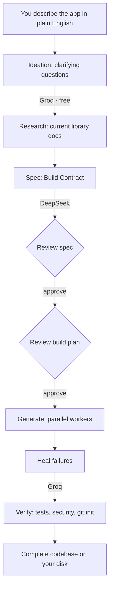

<div align="center">

# Pragma

### Describe an app in plain English. Get working code on your machine.

[](https://go.dev)
[](https://python.org)
[](LICENSE)

</div>

---

## What is Pragma?

Pragma is a tool that turns plain English descriptions into complete applications. You tell it what you want to build, it asks a few clarifying questions, then generates the source code: APIs, databases, authentication, Docker configs, and tests.

No coding experience required. No subscription. Everything runs locally on your machine.

**Example:** Type *"A freelancer client portal where I share project updates with clients, they approve milestones, I send invoices with line items, they pay online, and we both see a dashboard with progress and payment history"* and Pragma generates:

- Multi-role authentication (freelancer and client accounts)
- Project and milestone tracking with approval workflows
- Invoice generation with line items and PDF export
- Online payment integration
- Real-time dashboard with charts for both sides
- File sharing for deliverables
- Email notifications for milestones, invoices, and payments
- Docker Compose setup so you can run it immediately
- A test suite covering the main workflows
- A README explaining how to use it

## ⚡ UI Workflows

Pragma's web UI provides a modern, iterative development experience:
- **Iterative Spec Refinement:** Chat with the AI during the "Spec Review" phase to tweak database models and endpoints before generation begins.
- **Previous Project Gallery:** A sidebar tracks all your historical runs, allowing you to instantly revisit past projects and download their source code as a ZIP archive.

You own the code. It lives on your disk, not in someone's cloud.

## Get Started

You don't need to install Go or Node to run Pragma. Download the binary, set up the Python daemon once, add two API keys, and describe your app.

### 1. Download Pragma

Go to **[Releases](https://github.com/sarv-projects/pragma/releases/latest)** and download the binary for your OS:

| OS | File |
|----|------|
| Linux (x86) | `pragma-linux-amd64` |
| Mac (Apple Silicon) | `pragma-darwin-arm64` |
| Mac (Intel) | `pragma-darwin-amd64` |
| Windows | `pragma-windows-amd64.exe` |

**Linux / Mac** — make it executable and move it to your PATH:

```bash
chmod +x pragma-linux-amd64
sudo mv pragma-linux-amd64 /usr/local/bin/pragma
```

### 2. Install the Python Daemon

Pragma uses a small Python process to talk to the AI. After the binary is on your PATH, run:

```bash
pragma setup
```

This creates `~/.pragma/venv`, installs dependencies, and prepares the daemon.

> **Requires Python 3.11+.** Get it at [python.org/downloads](https://www.python.org/downloads/) if you do not have it.

### 3. Run Pragma

```bash
pragma
```

Your browser opens at `http://localhost:3777`. On **WSL**, the URL is printed in the terminal — paste it into your Windows browser (Edge, Chrome, or Firefox).

### 4. Add Your API Keys in the Setup Guide

On first run, the **Setup Guide** walks you through both keys step by step.

**DeepSeek** (required — powers code generation; pay-as-you-go):

1. Sign up at [platform.deepseek.com](https://platform.deepseek.com)
2. Top Up → add a small credit balance (no subscription). $2 is enough for many projects.
3. API Keys → Create key → paste it in the Setup Guide

**Groq** (required — free, enables image analysis and faster chat):

1. Sign up at [console.groq.com](https://console.groq.com) (no credit card)
2. API Keys → Create → paste in the Setup Guide

> **Both keys are required.** DeepSeek writes your application code. Groq powers the conversation, image analysis, and fast repair passes — at no cost.

### 5. Describe Your App

Type what you want in plain English. Pragma auto-selects a sensible stack from your description (you can steer it in text, e.g. “use Node and React” or “backend only”), asks a few questions, then generates:

- A complete REST API (Python, Node.js, or Go)
- Or a full-stack web app with Next.js when your description implies a UI
- Database setup (PostgreSQL or SQLite)
- Docker Compose so you can run it immediately
- Tests, security checks, and a plain-English README for the output folder

Scope: Pragma targets web backends and full-stack web apps. It does not generate native mobile apps (iOS/Android binaries).

### Upload an Image (Optional)

Have a mockup, screenshot, or architecture diagram? Upload it during project setup. Vision analysis (**Groq Llama 4 Scout**) extracts API design, data models, and integrations into your project manifest. Images are sent to Groq only, not to DeepSeek.

### Check Your Setup

```bash
pragma doctor
```

Checks Python, the daemon, your API keys, Docker, and network connectivity.

### Upgrade

```bash
pragma upgrade
```

Updates the binary and the Python daemon from GitHub Releases.

---

## Who is this for?

Pragma is designed for people who have ideas for applications but don't want to learn to code or hire developers. It's also useful for developers who want to prototype quickly or generate boilerplate code.

You describe what you want in plain English, and Pragma generates working source code: APIs, databases, authentication, Docker configs, and tests. You review the plan before generation starts, and you can adjust it if needed.

The code runs on your machine. You provide DeepSeek and Groq API keys (pay-as-you-go, typically a few cents per project). No Pragma subscription required.

---

## How it compares

| | **Pragma** | Lovable | Bolt.new | Cursor | Devin |
|---|---|---|---|---|---|
| What it is | Plain English to complete app generator | Plain English to hosted app builder | Plain English to hosted app builder | IDE with AI assistance | AI software engineer |
| Target user | Non-coders and developers | Non-coders | Non-coders | Developers | Engineering teams |
| Where code lives | Your disk, always | Their cloud | Their cloud | Your machine | Their cloud (PRs to your repo) |
| Cost model | Pay-as-you-go AI keys | Monthly subscription | Monthly subscription | Monthly subscription | Enterprise pricing |
| What you get | Complete source code (API, DB, auth, Docker, tests) | Hosted app with backend | Hosted app with backend | AI-assisted coding | Autonomous task execution |
| Runs offline | Yes | No | No | Yes (IDE only) | No |
| Own the code | Yes, full source | Export possible | Export possible | Yes (your code) | Yes (via PRs) |

---

## What you get

Every generated project includes:

- Complete source files for your application
- Database models and migrations (PostgreSQL or SQLite)
- API routes with authentication (JWT, OAuth, or session-based)
- OpenAPI 3.0 specification (API documentation)
- CI workflows (GitHub Actions for linting and testing)
- Dockerfile and docker-compose.yml to run the app locally
- A test suite covering the main workflows
- A README explaining how to use the generated project

Available stacks (auto-selected from your description, or specify your preference):

| Profile | Stack | Database |
|---------|-------|----------|
| `fastapi-async` | Python 3.12, FastAPI, SQLAlchemy 2.0, Alembic | PostgreSQL |
| `fastapi-async-sqlite` | Python 3.12, FastAPI, SQLAlchemy 2.0, Alembic | SQLite |
| `express-drizzle` | TypeScript, Express 5, Drizzle ORM | PostgreSQL |
| `express-drizzle-sqlite` | TypeScript, Express 5, Drizzle ORM | SQLite |
| `express-prisma` | TypeScript, Express 5, Prisma | PostgreSQL |
| `express-prisma-sqlite` | TypeScript, Express 5, Prisma | SQLite |
| `hono-drizzle` | TypeScript, Hono, Drizzle ORM (edge-ready) | PostgreSQL |
| `hono-drizzle-sqlite` | TypeScript, Hono, Drizzle ORM (edge-ready) | SQLite |
| `nextjs-app` | TypeScript, Next.js App Router, Drizzle | PostgreSQL |
| `fiber-sqlc` | Go, Fiber v3, sqlc, pgx | PostgreSQL |
| `fiber-sqlc-sqlite` | Go, Fiber v3, sqlc | SQLite |

---

## How it works



1. **Ideation** — You describe what you want; Pragma asks clarifying questions (powered by Groq)
2. **Research** — Pulls current documentation for libraries in your stack
3. **Spec** — Generates a Build Contract: files, signatures, dependencies, and edge cases
4. **Review** — You see the plan and estimates before generation starts. Approve or adjust.
5. **Generate** — Writes files in dependency order; each file is checked against the contract
6. **Heal** — Failed validations are repaired automatically when possible
7. **Verify** — Runs tests, security scans, and static analysis, then initializes git

Every step is checkpointed. If you close the tab or lose power, you can resume where you left off.

---

## Architecture

Three languages, each doing what it does best, in one self-contained binary.

```
Browser  ──  SvelteKit SPA, embedded in the Go binary
   │
   │  WebSocket + REST   (localhost:3777)
   ▼
Go Binary  ──  HTTP/WS server · pipeline · budget caps · checkpoints · daemon lifecycle
   │
   │  JSON-RPC 2.0 over a Unix domain socket
   ▼
Python Daemon  ──  LLM calls · spec compiler · parallel codegen · tree-sitter · heal · research
   │
   ├──▶  DeepSeek API   ──  spec + code generation   (pay-as-you-go)
   └──▶  Groq API       ──  ideation · vision · healing   (free tier)
```

The Go binary embeds the compiled UI, so `pragma` is a single file you can copy — no separate frontend server or node_modules required.

- **Go** — server, orchestration, budget enforcement, checkpointing, keyring integration
- **Python** — all model calls, spec compilation, codegen, conformance, healing, research, audits
- **Svelte** — live progress, spec review, setup guide, and approval gates

---

## Quick start (from source)

For contributors or anyone building from the repo:

### Linux / macOS / WSL

```bash
git clone https://github.com/sarv-projects/pragma.git
cd pragma
./install.sh
pragma
```

### Windows (PowerShell)

```powershell
git clone https://github.com/sarv-projects/pragma.git
cd pragma
.\install.ps1
pragma
```

The browser opens at `localhost:3777`. The Setup Guide runs on first launch until both API keys are saved.

What you'll need:
- DeepSeek key — [platform.deepseek.com](https://platform.deepseek.com). Pay-as-you-go; $2 (the minimum top-up) covers many projects. Pragma defaults to a $0.25 per project and $2.00 total spend cap.
- Groq key — [console.groq.com](https://console.groq.com). Free tier; no credit card required.

After keys are set, describe your project. Pragma picks the stack; override in natural language if you prefer (e.g. “Next.js dashboard”, “Python API only”, “use PostgreSQL”).

---

## Commands

```bash
pragma                           # Start the web UI (opens localhost:3777)
pragma setup                     # Create ~/.pragma venv and install the daemon
pragma --tui                     # Terminal UI, no browser
pragma --headless < input.json   # CI / automation: manifest in, events out
pragma doctor                    # Check Python, daemon, keys, Docker
pragma upgrade                   # Self-update binary + daemon (SHA256 verified)
pragma clean                     # Remove old run directories (keeps 5 most recent)
pragma publish                   # Init git + print push instructions for a generated project
pragma --budget 0.50             # Override per-run budget cap for this run
pragma --version                 # Print version and exit
```

---

## Configuration

`~/.pragma/config.toml` — created on first run. Editable from the web UI as well.

```toml
mode    = "fast"           # DeepSeek direct API
profile = "fastapi-async"  # Fallback profile if auto-selection has nothing to match

[budget]
lifetime_cap = 2.00        # Hard cap on total DeepSeek spend ($)
per_run_cap  = 0.25        # Cap per project ($)

[output]
directory = "./output"     # Where generated projects are written
```

---

## Privacy

Generated source code stays on your disk. Pragma does not host your project or run a Pragma cloud backend.

The only data that leaves your machine is what you send to DeepSeek and Groq under your own API keys — the same as calling those APIs directly. There is no Pragma account and no telemetry. Keys are stored in your OS keyring when available, with a restricted fallback file under `~/.pragma/` on setups without a keyring (e.g. some WSL/CI environments).

---

## Contributing

```bash
# Build
go build ./...
cd web && npm run build

# Test
go test ./...
cd daemon && pytest

# Lint
ruff check daemon/pragma_daemon
go vet ./...
```

Read [`spec.md`](spec.md) before architectural changes — it is the design reference for this repository.

---

## License

MIT — [Sarvesh Bhattacharyya](https://github.com/sarv-projects)
