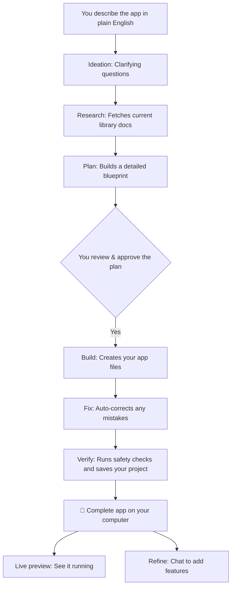

<div align="center">

# Pragma

### Describe an app in plain English. Get a complete, working app on your computer. 🚀

*No coding experience required. No monthly subscriptions. You own the app.*

[](https://github.com/sarv-projects/pragma/discussions)
[](LICENSE)

</div>

---

## What is Pragma?

Pragma is a tool that turns your plain English ideas into complete, working applications. You tell it what you want to build, it asks a few simple clarifying questions, and then it builds the app for you.

**Example:** Type *"A freelancer client portal where I share project updates, clients approve milestones, I send invoices, they pay online, and we both see a dashboard with progress"* and Pragma generates the entire working application — database, user accounts, API routes, a Dockerfile, tests, and a plain-English README.

Everything runs locally on your computer. You do not need to be a developer to use it.

---

## Who is this for?

- **Non-coders & Founders**: You have an idea for an app but don't want to learn to program or hire expensive developers.
- **Developers**: You want to prototype ideas instantly or generate robust starting files without the repetitive setup.

---

## How it compares

| | **Pragma** | Lovable / Bolt.new | Cursor | Devin |
|---|---|---|---|---|
| **What it is** | Plain English to complete app builder | Hosted app builders | AI-assisted editor | AI software engineer |
| **Target user** | Non-coders & developers | Non-coders | Developers | Engineering teams |
| **Where it lives** | **Your computer, always** | Their cloud | Your machine | Their cloud |
| **Cost model** | Pay-as-you-go AI keys (cents per project) | Monthly subscription | Monthly subscription | Enterprise pricing |
| **What you get** | Complete app files (database, logins, setup, checks) | Hosted app | AI-assisted building | Autonomous task execution |
| **Code generation** | Full backend + frontend + Docker + tests | Mostly frontend | Edits existing code | Edits existing code |
| **LLM choice** | Bring Your Own Key (DeepSeek, OpenAI, Ollama, OpenRouter, etc.) | Locked to their models | Locked to their models | Locked to their models |
| **Live preview** | ✅ In-browser dev server preview | ✅ Built-in | ❌ | ❌ |

---

## Get Started in 3 Minutes

You don't need to install any programming tools manually. Pragma handles all the technical setup for you in the background.

### 1. Download Pragma
Go to the **[Releases page](https://github.com/sarv-projects/pragma/releases/latest)** and download the single file for your computer:
- **Linux**: `pragma-linux-amd64`
- **Mac (Apple Silicon)**: `pragma-darwin-arm64`
- **Mac (Intel)**: `pragma-darwin-amd64`
- **Windows**: `pragma-windows-amd64.exe`

*(Linux/Mac users: Make it executable by running `chmod +x <filename>` and move it to your system, e.g., `sudo mv <filename> /usr/local/bin/pragma`)*

### 2. Run the Setup
Open your terminal (or Command Prompt on Windows) and run:
```bash
pragma setup
```
*Pragma will automatically create a safe, isolated environment and install everything it needs behind the scenes.*

### 3. Start Pragma
```bash
pragma
```
Your default web browser will automatically open to `http://localhost:3777`. 
*(If you are using WSL on Windows, the URL will be printed in your terminal. Just copy and paste it into your Windows browser).*

### 4. Add Your API Keys
On your first run, the friendly in-app **Setup Guide** will walk you through adding your API keys step-by-step:
1. **Code generation key** (Required): Pragma supports **any OpenAI-compatible provider** — DeepSeek (recommended, ~$0.03/project), OpenAI, OpenRouter, Together AI, or local models via Ollama. Add your own API key and choose your provider.
2. **Groq key** (Optional, free): Adds image analysis support and faster chat responses. Get a free key at [console.groq.com](https://console.groq.com).

### 5. Describe Your App
Type what you want to build in plain English. Pragma will auto-select the best technology, ask a few clarifying questions, and build your complete application.

> **Stuck?** Run `pragma doctor` in your terminal. It will check everything and tell you exactly how to fix any issues.

---

## What You Can Do

- **Build complete apps** from a single sentence description
- **Upload screenshots or wireframes** — Pragma's Groq vision reads them and extracts the app design
- **Iterate during generation** — forgot something mid-build? Type it in and it queues for post-generation refinement
- **Live preview** — see your app running in your browser with one click
- **Refine your projects** — chat with Pragma after generation to add features or fix issues
- **Use your own AI models** — BYOK with OpenAI, Anthropic, Ollama, OpenRouter, Together, or any OpenAI-compatible provider
- **Review the plan** before building — approve the architecture blueprint, then approve the execution plan

---

## What You Get

Every generated project is ready to use and includes:
- ✅ All the source files for your application
- ✅ Database setup (PostgreSQL or SQLite, with migrations)
- ✅ User accounts and secure logins (JWT authentication)
- ✅ A Docker setup to run the app immediately
- ✅ Automated tests
- ✅ Built-in checks that catch mistakes and auto-fix them
- ✅ A plain-English guide explaining how to use your new app

---

## How it Works



---

## Privacy & Security

- **Your App is Yours**: Generated files stay on your disk. Pragma does not host your project or run a cloud backend.
- **No Telemetry**: The only data that leaves your machine is what you send directly to your chosen AI provider(s) under your own API keys.
- **Secure Storage**: API keys are stored securely in your operating system's keyring or in an encrypted file.

If you discover a security vulnerability, please refer to our [Security Policy](SECURITY.md).

---

## Community & Support

- 💬 **Questions & Ideas**: Join our [GitHub Discussions](https://github.com/sarv-projects/pragma/discussions)
- 🐛 **Bug Reports**: Open an issue on [GitHub Issues](https://github.com/sarv-projects/pragma/issues)

---

<details>
<summary><strong>⚙️ Advanced: Commands, Configuration & Building (Click to expand)</strong></summary>

*This section covers the technical details for developers and power users. For full architecture, see [`spec.md`](spec.md).*

### Useful Commands
```bash
pragma                           # Start the web UI (default)
pragma setup                     # Install background dependencies
pragma doctor                    # Check your setup, keys, and connectivity
pragma --tui                     # Use the terminal interface instead of browser
pragma --headless                # CI mode — read manifest from stdin
pragma --budget 0.50             # Set a per-run spending limit
pragma upgrade                   # Update Pragma to the latest version
pragma clean                     # Remove old generated projects (keeps 5 most recent)
```

### Configuration
Settings in `~/.pragma/config.toml`:
```toml
profile = "fastapi-async"  # Default tech stack

[budget]
lifetime_cap = 2.00        # Total spend cap ($)
per_run_cap  = 0.25        # Per-project cap ($)

[output]
directory = "./output"     # Where generated projects go
git_init  = true           # Auto-create git repo

[provider]
name             = "deepseek"
base_url         = "https://api.deepseek.com"
reasoning_model  = ""
codegen_model    = ""
supports_thinking = true
```

### Architecture
Pragma is a single Go binary that spawns a Python daemon for AI work and serves a modern web interface:
- **Go** — web server, pipeline orchestration, budget enforcement, checkpointing
- **Python** — LLM calls (via your API keys), spec compilation, code generation, AST checking
- **SvelteKit** — embedded web app for real-time progress, plan review, and approvals

### Build from Source
```bash
git clone https://github.com/sarv-projects/pragma.git
cd pragma
./install.sh           # Linux / macOS / WSL
# or: .\install.ps1    # Windows

# Before submitting a PR:
go build ./...
go test ./...
cd daemon && pytest
cd web && npm run build
```
</details>

---

## License

MIT — [Sarvesh Bhattacharyya](https://github.com/sarv-projects)
