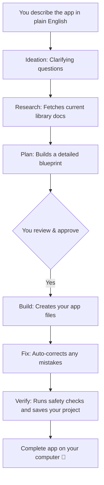

<div align="center">

# Pragma

### Describe an app in plain English. Get a complete, working app on your computer. 🚀

*No coding experience required. No monthly subscriptions. You own the app.*

[](https://github.com/sarv-projects/pragma/discussions)
[](LICENSE)

</div>

---

## What is Pragma?

Pragma is a tool that turns your plain English ideas into complete, working applications. You tell it what you want to build, it asks a few simple clarifying questions, and then it builds the app for you.

**Example:** Type *"A freelancer client portal where I share project updates, clients approve milestones, I send invoices, they pay online, and we both see a dashboard with progress"* and Pragma generates the entire working application.

Everything runs locally on your computer. You do not need to be a developer to use it.

---

## Who is this for?

- **Non-coders & Founders**: You have an idea for an app but don't want to learn to program or hire expensive developers.
- **Developers**: You want to prototype ideas instantly or generate robust starting files without the repetitive setup.

---

## How it compares

| | **Pragma** | Lovable / Bolt.new | Cursor | Devin |
|---|---|---|---|---|
| **What it is** | Plain English to complete app builder | Hosted app builders | AI-assisted editor | AI software engineer |
| **Target user** | Non-coders & developers | Non-coders | Developers | Engineering teams |
| **Where it lives** | **Your computer, always** | Their cloud | Your machine | Their cloud |
| **Cost model** | Pay-as-you-go AI keys (cents per project) | Monthly subscription | Monthly subscription | Enterprise pricing |
| **What you get** | Complete app files (database, logins, setup, checks) | Hosted app | AI-assisted building | Autonomous task execution |

---

## Get Started in 3 Minutes

You don't need to install any programming tools manually. Pragma handles all the technical setup for you in the background.

### 1. Download Pragma
Go to the **[Releases page](https://github.com/sarv-projects/pragma/releases/latest)** and download the single file for your computer:
- **Linux**: `pragma-linux-amd64`
- **Mac (Apple Silicon)**: `pragma-darwin-arm64`
- **Mac (Intel)**: `pragma-darwin-amd64`
- **Windows**: `pragma-windows-amd64.exe`

*(Linux/Mac users: Make it executable by running `chmod +x <filename>` and move it to your system, e.g., `sudo mv <filename> /usr/local/bin/pragma`)*

### 2. Run the Setup
Open your terminal (or Command Prompt on Windows) and run:
```bash
pragma setup
```
*Don't worry about dependencies—Pragma will automatically create a safe, isolated environment and install everything it needs behind the scenes.*

### 3. Start Pragma
```bash
pragma
```
Your default web browser will automatically open to `http://localhost:3777`. 
*(Note: If you are using WSL on Windows, the URL will be printed in your terminal. Just copy and paste it into your Windows browser).*

### 4. Add Your API Keys
On your first run, the friendly in-app **Setup Guide** will walk you through adding two API keys step-by-step:
1. **DeepSeek** (Required): Powers the app building. Pay-as-you-go (a $2 top-up is enough for many projects).
2. **Groq** (Required): Powers the conversation and image analysis. Completely free, no credit card required.

### 5. Describe Your App
Type what you want to build in plain English. Pragma will auto-select the best technology, ask a few clarifying questions, and build your complete application.

> **Stuck?** Run `pragma doctor` in your terminal. It will automatically check your setup, keys, and network connectivity and tell you exactly how to fix any issues.

---

## What You Get

Every generated project is ready to use and includes:
- ✅ All the files needed for your application
- ✅ Database setup (PostgreSQL or SQLite)
- ✅ User accounts and secure logins
- ✅ An easy setup to run the app immediately on your computer
- ✅ Built-in checks to make sure everything works correctly
- ✅ A plain-English guide explaining how to use your new app

---

## How it Works



---

<details>
<summary><strong>⚙️ Advanced: Architecture, Commands & Contributing (Click to expand)</strong></summary>

*Note: This section is for developers and technical contributors. For full technical architecture details, please see [`spec.md`](spec.md).*

### Architecture
Pragma uses a lightweight, self-contained design:
- **Go Binary**: The main application. It runs the web server, manages your budget, and orchestrates the workflow.
- **Python Background Process**: Handles all the heavy lifting: talking to AI models, compiling specs, and generating code.
- **SvelteKit UI**: A modern, embedded web interface for live progress, plan review, and approvals.

### Useful Commands
```bash
pragma                           # Start the web UI
pragma setup                     # Automatically install background dependencies
pragma --tui                     # Use the terminal interface instead of the browser
pragma doctor                    # Check your setup, keys, and connectivity
pragma upgrade                   # Safely update Pragma to the latest version
pragma clean                     # Remove old generated projects (keeps the 5 most recent)
pragma --budget 0.50             # Set a strict spending limit for a single run
```

### Configuration
You can adjust settings in `~/.pragma/config.toml`:
```toml
mode    = "fast"           # AI provider mode
profile = "fastapi-async"  # Default tech stack

[budget]
lifetime_cap = 2.00        # Hard cap on total spend ($)
per_run_cap  = 0.25        # Cap per project ($)
```

### Contributing & Source Build
We welcome contributions! 

**To build from source:**
```bash
git clone https://github.com/sarv-projects/pragma.git
cd pragma

# Linux / macOS / WSL
./install.sh

# Windows (PowerShell)
.\install.ps1
```

**Before submitting a Pull Request, please run:**
```bash
go build ./...
go test ./...
cd daemon && pytest
cd web && npm run build
```
</details>

---

## Privacy & Security

- **Your App is Yours**: Generated files stay on your disk. Pragma does not host your project or run a cloud backend.
- **No Telemetry**: The only data that leaves your machine is what you send directly to DeepSeek and Groq under your own API keys.
- **Secure Storage**: API keys are stored securely in your operating system's keyring. 

If you discover a security vulnerability, please refer to our [Security Policy](SECURITY.md).

---

## Community & Support

- 💬 **Questions & Ideas**: Join our [GitHub Discussions](https://github.com/sarv-projects/pragma/discussions)
- 🐛 **Bug Reports**: Open an issue on [GitHub Issues](https://github.com/sarv-projects/pragma/issues)

---

## License

MIT — [Sarvesh Bhattacharyya](https://github.com/sarv-projects)
